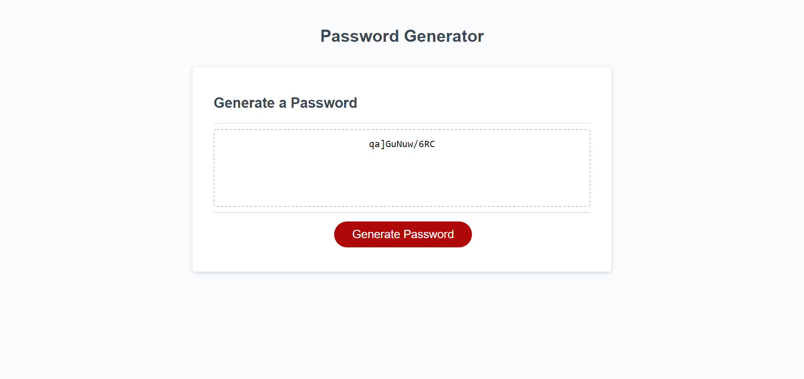

# Password Generator Project

## Table of contents
1. [Description](#description)
2. [Visuals](#visuals)

## Description
This is a javascript based password generator. Users press the "Generate Password" button, answer a prompt for the password length and confirm whether or not to include lowercase, uppercase, numbers, and special characters. The password is generated.
[Link to live site](https://bbelk.github.io/password-generator-project/) 

## Visuals
